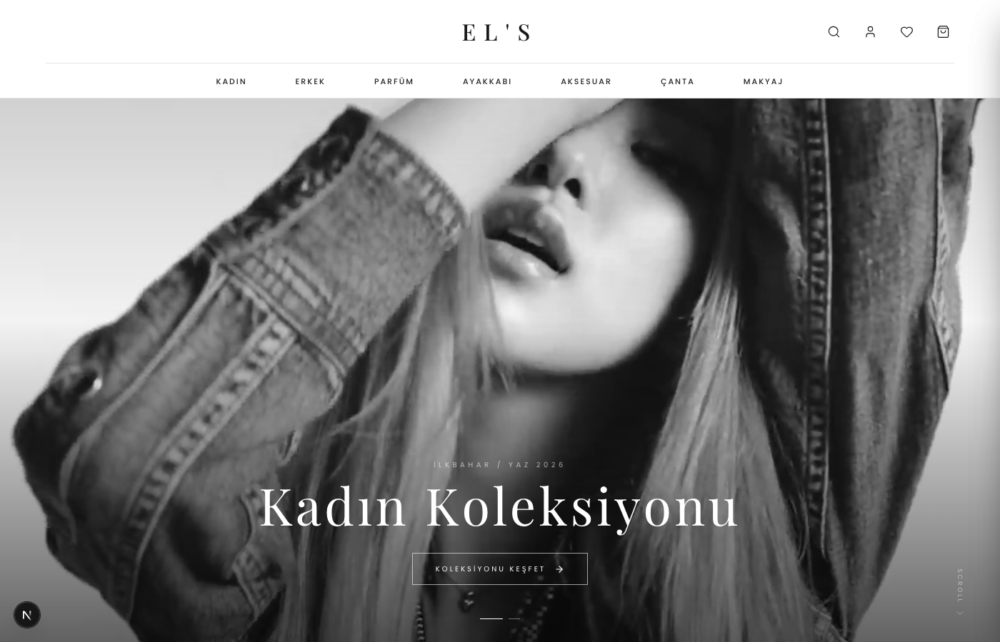
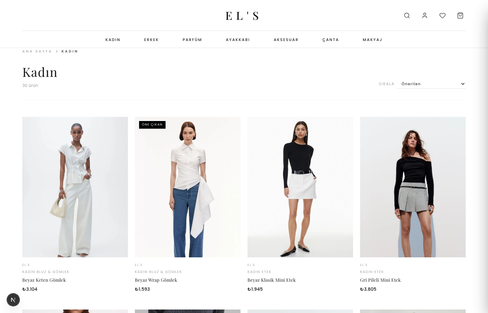
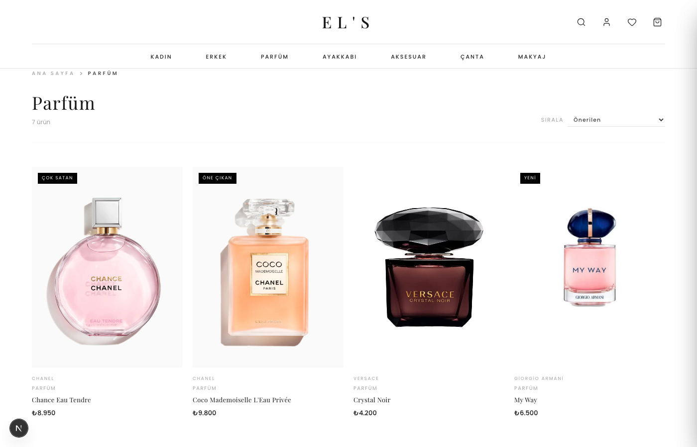
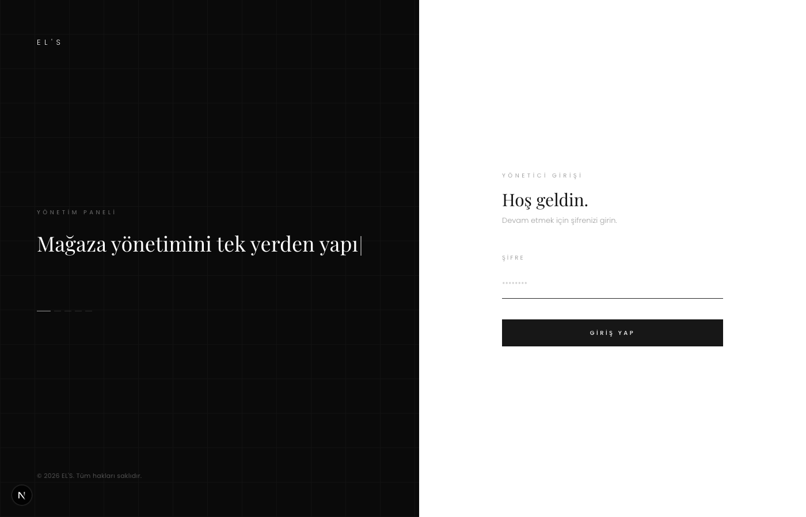
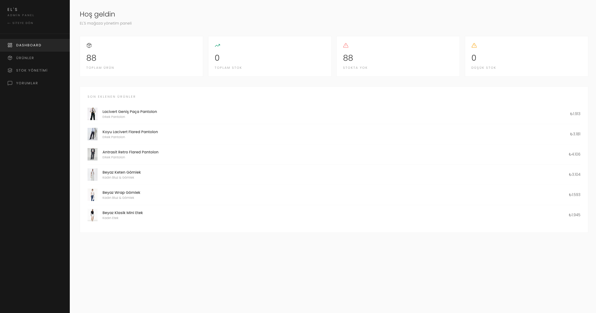
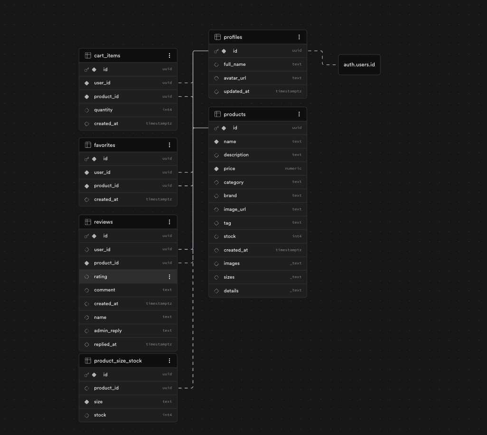

<div align="center">

# EL'S — Luxury Fashion & Lifestyle E-Commerce

**Designed and developed by [codedbyelif](https://github.com/codedbyelif)**

[English](#english-usage-guide) | [Türkçe](#türkçe-kullanım-kılavuzu)

**EL'S** is a luxury fashion and lifestyle e-commerce platform designed to offer a premium online shopping experience. The platform covers a wide range of categories — women's and men's clothing, shoes, bags, accessories, perfume, and makeup — all presented with a clean, editorial aesthetic inspired by high-end fashion brands.

The project consists of two parts: a **customer-facing storefront** where users can browse collections, search products, add items to their cart, save favorites, and leave reviews; and a **password-protected admin panel** where the store owner can manage the entire product catalog, upload images, track stock, and moderate customer reviews — all from a single dashboard.

Built entirely from scratch as a personal project, EL'S combines modern web technologies with a minimalist black-and-white design language to deliver a boutique shopping experience.

</div>

---

## English Usage Guide

## Screenshots

### Storefront — Home Page


### Storefront — Category Page (Women's)


### Storefront — Parfüm Category


### Admin Panel — Login


### Admin Panel — Dashboard


### Database Schema (Supabase)


---

## Overview

EL'S is split into **two distinct sections**:

| Section | Path | Description |
|---|---|---|
| **Storefront** | `/` | Public-facing shop where users browse, search, favorite, and cart products |
| **Admin Panel** | `/admin` | Password-protected dashboard for managing products, reviews, and analytics |

---

## Tech Stack

| Layer | Technology |
|---|---|
| **Framework** | Next.js 16.2.1 (App Router) |
| **Language** | TypeScript 5 (strict mode) |
| **UI** | React 19, Tailwind CSS 4 |
| **Database** | Supabase (PostgreSQL) |
| **Auth** | Supabase Auth (users) + password-based (admin) |
| **State** | React Context API + localStorage |
| **Icons** | Lucide React |
| **Fonts** | Poppins, Playfair Display |
| **Deployment** | Vercel-ready |

---

## Features

### Storefront (User-Facing)
- Browse products by category: **Kadın, Erkek, Parfüm, Ayakkabı, Aksesuar, Çanta, Makyaj**
- Dynamic subcategories (e.g. `/kadin/elbise`, `/erkek/takim`)
- Full-text product search
- Add to cart (persisted in localStorage)
- Favorites / wishlist (synced with Supabase for logged-in users)
- Product detail page with size selection, image gallery, and reviews
- User registration & login via Supabase Auth
- Star ratings and customer reviews
- Sale banner
- Terms of Service page

### Admin Panel
- Password-protected login page
- Full product CRUD (create, read, update, delete)
- Multi-image upload per product
- Size & stock management per size
- Category assignment from predefined list
- Customer review management + admin replies
- Analytics dashboard
- Product search and filtering

---

## Project Structure

```
els-ecommerce/
├── src/
│   ├── app/
│   │   ├── page.tsx                  # Home page
│   │   ├── layout.tsx                # Root layout
│   │   ├── admin/
│   │   │   ├── page.tsx              # Admin login
│   │   │   └── dashboard/page.tsx    # Admin dashboard
│   │   ├── kadin/[slug]/             # Women's categories
│   │   ├── erkek/[slug]/             # Men's categories
│   │   ├── ayakkabi/[slug]/          # Shoes
│   │   ├── canta/[slug]/             # Bags
│   │   ├── aksesuar/[slug]/          # Accessories
│   │   ├── parfum/[slug]/            # Perfume
│   │   ├── makyaj/[slug]/            # Makeup
│   │   ├── arama/                    # Search
│   │   └── favorilerim/              # Favorites
│   ├── components/
│   │   ├── Navbar.tsx
│   │   ├── Footer.tsx
│   │   ├── ProductCard.tsx
│   │   ├── ProductListing.tsx
│   │   ├── ProductDetailView.tsx
│   │   └── SaleBanner.tsx
│   ├── context/
│   │   ├── CartContext.tsx
│   │   └── FavoritesContext.tsx
│   ├── hooks/
│   │   ├── useFavorites.ts
│   │   └── useProductSort.ts
│   └── lib/
│       ├── supabase.ts
│       └── categories.ts
├── public/                           # Static product images
├── supabase_schema.sql               # Full database schema
├── migrate-products.js               # Product seed script
├── upload-images.js                  # Image upload utility
└── update-prices.sql                 # SQL for batch price updates
```

---

## Database Schema

The database runs on **Supabase (PostgreSQL)** with Row-Level Security (RLS) enabled on all tables.

```sql
-- Core tables
profiles       -- User profiles (linked to auth.users via trigger)
products       -- Product catalog
cart_items     -- Per-user shopping carts
favorites      -- Per-user saved products
reviews        -- Product reviews with star ratings (1–5)
```

**RLS Policies:**
- `profiles` — users can only view/update their own profile
- `products` — public read access; write access managed via Supabase dashboard or admin scripts
- `cart_items` — users can only access their own cart
- `favorites` — users can only access their own favorites
- `reviews` — anyone can read; only authenticated users can write; users can only edit/delete their own

**Auth Trigger:**
When a new user signs up via Supabase Auth, a `profiles` row is automatically created:

```sql
CREATE TRIGGER on_auth_user_created
  AFTER INSERT ON auth.users
  FOR EACH ROW EXECUTE FUNCTION public.handle_new_user();
```

The full schema is in [supabase_schema.sql](supabase_schema.sql).

---

## Getting Started

### Prerequisites

- Node.js 18+
- npm
- A [Supabase](https://supabase.com) project (free tier works)

### 1. Clone the repository

```bash
git clone https://github.com/codedbyelif/els-ecommerce.git
cd els-ecommerce
```

### 2. Install dependencies

```bash
npm install
```

### 3. Set up environment variables

Create a `.env` file in the root of the project:

```env
NEXT_PUBLIC_SUPABASE_URL=your_supabase_project_url
NEXT_PUBLIC_SUPABASE_ANON_KEY=your_supabase_anon_key
```

You can find these values in your Supabase project under **Settings → API**.

### 4. Set up the database

Go to your Supabase project → **SQL Editor**, paste and run the contents of [supabase_schema.sql](supabase_schema.sql).

This will create all tables, enable RLS, apply policies, and set up the auth trigger.

### 5. Run the development server

```bash
npm run dev
```

Open [http://localhost:3000](http://localhost:3000) to view the storefront.

---

## Admin Panel

The admin panel is accessible at `/admin`.

**Default password:** `admin123`

> The admin session is stored in `localStorage` under the key `admin_auth`. This is a simple authentication mechanism suitable for personal/demo projects. For production use, replace with a proper server-side authentication solution.

### What you can do in the admin panel:
- Add, edit, and delete products
- Upload multiple images per product
- Set stock levels per size
- View and respond to customer reviews
- Monitor analytics

---

## Deployment

This project is optimized for **Vercel**:

```bash
npm run build
```

Or deploy directly via the Vercel CLI or by connecting your GitHub repository to [vercel.com](https://vercel.com).

Make sure to add your environment variables (`NEXT_PUBLIC_SUPABASE_URL` and `NEXT_PUBLIC_SUPABASE_ANON_KEY`) in your Vercel project settings under **Settings → Environment Variables**.

---

## Environment Variables Reference

| Variable | Required | Description |
|---|---|---|
| `NEXT_PUBLIC_SUPABASE_URL` | Yes | Your Supabase project URL (e.g. `https://xxxx.supabase.co`) |
| `NEXT_PUBLIC_SUPABASE_ANON_KEY` | Yes | Your Supabase anonymous/public API key |

---

## Language & Localization

The UI is fully in **Turkish**. Category routes use Turkish slugs:

| Route | Category |
|---|---|
| `/kadin` | Women (Kadın) |
| `/erkek` | Men (Erkek) |
| `/ayakkabi` | Shoes (Ayakkabı) |
| `/canta` | Bags (Çanta) |
| `/aksesuar` | Accessories (Aksesuar) |
| `/parfum` | Perfume (Parfüm) |
| `/makyaj` | Makeup (Makyaj) |

---

## License

This project was designed and built by **[codedbyelif](https://github.com/codedbyelif)**.  
All rights reserved © 2026 EL'S. See [LICENSE](LICENSE) for details.

---

## Türkçe Kullanım Kılavuzu

## Ekran Görüntüleri

### Mağaza — Ana Sayfa


### Mağaza — Kategori Sayfası (Kadın)


### Mağaza — Parfüm Kategorisi


### Yönetim Paneli — Giriş


### Yönetim Paneli — Dashboard


### Veritabanı Şeması (Supabase)


---

## Genel Bakış

EL'S iki ana bölümden oluşmaktadır:

| Bölüm | Adres | Açıklama |
|---|---|---|
| **Mağaza** | `/` | Kullanıcıların ürünlere göz attığı, arama yaptığı, favorilere eklediği ve sepete koyduğu genel arayüz |
| **Yönetim Paneli** | `/admin` | Ürün, yorum ve analitik yönetimi için şifreyle korunan dashboard |

---

## Teknoloji Yığını

| Katman | Teknoloji |
|---|---|
| **Framework** | Next.js 16.2.1 (App Router) |
| **Dil** | TypeScript 5 (strict mod) |
| **Arayüz** | React 19, Tailwind CSS 4 |
| **Veritabanı** | Supabase (PostgreSQL) |
| **Kimlik Doğrulama** | Supabase Auth (kullanıcılar) + şifre tabanlı (admin) |
| **State Yönetimi** | React Context API + localStorage |
| **İkonlar** | Lucide React |
| **Fontlar** | Poppins, Playfair Display |
| **Yayınlama** | Vercel uyumlu |

---

## Özellikler

### Mağaza (Kullanıcı Arayüzü)
- Kategoriye göre ürün listeleme: **Kadın, Erkek, Parfüm, Ayakkabı, Aksesuar, Çanta, Makyaj**
- Dinamik alt kategoriler (örn. `/kadin/elbise`, `/erkek/takim`)
- Tam metin ürün arama
- Sepete ekleme (localStorage'da saklanır)
- Favoriler / istek listesi (giriş yapmış kullanıcılar için Supabase ile senkronize)
- Beden seçimi, görsel galerisi ve yorum içeren ürün detay sayfası
- Supabase Auth ile kullanıcı kaydı ve girişi
- Yıldızlı puanlama ve müşteri yorumları
- İndirim banner'ı
- Kullanım Koşulları sayfası

### Yönetim Paneli
- Şifreyle korunan giriş sayfası
- Tam ürün yönetimi (oluşturma, okuma, güncelleme, silme)
- Ürün başına çoklu görsel yükleme
- Bedene göre stok yönetimi
- Önceden tanımlı listeden kategori atama
- Müşteri yorum yönetimi + admin yanıtı
- Analitik dashboard
- Ürün arama ve filtreleme

---

## Proje Yapısı

```
els-ecommerce/
├── src/
│   ├── app/
│   │   ├── page.tsx                  # Ana sayfa
│   │   ├── layout.tsx                # Kök layout
│   │   ├── admin/
│   │   │   ├── page.tsx              # Admin girişi
│   │   │   └── dashboard/page.tsx    # Admin dashboard
│   │   ├── kadin/[slug]/             # Kadın kategorileri
│   │   ├── erkek/[slug]/             # Erkek kategorileri
│   │   ├── ayakkabi/[slug]/          # Ayakkabı
│   │   ├── canta/[slug]/             # Çanta
│   │   ├── aksesuar/[slug]/          # Aksesuar
│   │   ├── parfum/[slug]/            # Parfüm
│   │   ├── makyaj/[slug]/            # Makyaj
│   │   ├── arama/                    # Arama
│   │   └── favorilerim/              # Favoriler
│   ├── components/
│   │   ├── Navbar.tsx
│   │   ├── Footer.tsx
│   │   ├── ProductCard.tsx
│   │   ├── ProductListing.tsx
│   │   ├── ProductDetailView.tsx
│   │   └── SaleBanner.tsx
│   ├── context/
│   │   ├── CartContext.tsx
│   │   └── FavoritesContext.tsx
│   ├── hooks/
│   │   ├── useFavorites.ts
│   │   └── useProductSort.ts
│   └── lib/
│       ├── supabase.ts
│       └── categories.ts
├── public/                           # Statik ürün görselleri
├── supabase_schema.sql               # Veritabanı şeması
├── migrate-products.js               # Ürün seed scripti
├── upload-images.js                  # Görsel yükleme aracı
└── update-prices.sql                 # Toplu fiyat güncelleme SQL
```

---

## Veritabanı Şeması

Veritabanı, tüm tablolarda Satır Düzeyinde Güvenlik (RLS) etkinleştirilmiş **Supabase (PostgreSQL)** üzerinde çalışmaktadır.

```sql
-- Temel tablolar
profiles       -- Kullanıcı profilleri (auth.users ile trigger üzerinden bağlı)
products       -- Ürün kataloğu
cart_items     -- Kullanıcıya özel sepetler
favorites      -- Kullanıcıya özel kaydedilen ürünler
reviews        -- Yıldız puanlı ürün yorumları (1–5)
```

**RLS Politikaları:**
- `profiles` — kullanıcılar yalnızca kendi profillerini görüntüleyip güncelleyebilir
- `products` — herkese açık okuma; yazma erişimi Supabase dashboard veya admin scriptleri üzerinden
- `cart_items` — kullanıcılar yalnızca kendi sepetlerine erişebilir
- `favorites` — kullanıcılar yalnızca kendi favorilerine erişebilir
- `reviews` — herkes okuyabilir; yalnızca giriş yapmış kullanıcılar yazabilir; kullanıcılar yalnızca kendi yorumlarını düzenleyip silebilir

**Auth Trigger:**
Supabase Auth üzerinden yeni bir kullanıcı kayıt olduğunda `profiles` satırı otomatik oluşturulur:

```sql
CREATE TRIGGER on_auth_user_created
  AFTER INSERT ON auth.users
  FOR EACH ROW EXECUTE FUNCTION public.handle_new_user();
```

Tam şema [supabase_schema.sql](supabase_schema.sql) dosyasındadır.

---

## Başlarken

### Gereksinimler

- Node.js 18+
- npm
- Bir [Supabase](https://supabase.com) projesi (ücretsiz plan yeterlidir)

### 1. Repoyu klonlayın

```bash
git clone https://github.com/codedbyelif/els-ecommerce.git
cd els-ecommerce
```

### 2. Bağımlılıkları yükleyin

```bash
npm install
```

### 3. Ortam değişkenlerini ayarlayın

Projenin kök dizininde `.env` dosyası oluşturun:

```env
NEXT_PUBLIC_SUPABASE_URL=supabase_proje_adresiniz
NEXT_PUBLIC_SUPABASE_ANON_KEY=supabase_anon_keyiniz
```

Bu değerlere Supabase projenizden **Settings → API** altından ulaşabilirsiniz.

### 4. Veritabanını kurun

Supabase projenize gidin → **SQL Editor**, [supabase_schema.sql](supabase_schema.sql) içeriğini yapıştırıp çalıştırın.

Bu işlem tüm tabloları oluşturur, RLS'yi etkinleştirir, politikaları uygular ve auth trigger'ı kurar.

### 5. Geliştirme sunucusunu başlatın

```bash
npm run dev
```

Mağazayı görüntülemek için [http://localhost:3000](http://localhost:3000) adresini açın.

---

## Yönetim Paneli

Yönetim paneline `/admin` adresinden ulaşılır.

**Varsayılan şifre:** `admin123`

> Admin oturumu `localStorage`'da `admin_auth` anahtarı altında saklanır. Bu, kişisel veya demo projeler için uygun basit bir kimlik doğrulama yöntemidir. Canlı kullanım için sunucu taraflı bir kimlik doğrulama çözümüyle değiştirilmesi önerilir.

### Yönetim panelinde yapabilecekleriniz:
- Ürün ekleme, düzenleme ve silme
- Ürün başına çoklu görsel yükleme
- Bedene göre stok seviyesi belirleme
- Müşteri yorumlarını görüntüleme ve yanıtlama
- Analitikleri takip etme

---

## Yayınlama

Bu proje **Vercel** için optimize edilmiştir:

```bash
npm run build
```

Vercel CLI üzerinden veya GitHub reponuzu [vercel.com](https://vercel.com)'a bağlayarak doğrudan yayınlayabilirsiniz.

Vercel proje ayarlarındaki **Settings → Environment Variables** bölümüne `NEXT_PUBLIC_SUPABASE_URL` ve `NEXT_PUBLIC_SUPABASE_ANON_KEY` değerlerini eklemeyi unutmayın.

---

## Ortam Değişkenleri

| Değişken | Zorunlu | Açıklama |
|---|---|---|
| `NEXT_PUBLIC_SUPABASE_URL` | Evet | Supabase proje adresiniz (örn. `https://xxxx.supabase.co`) |
| `NEXT_PUBLIC_SUPABASE_ANON_KEY` | Evet | Supabase anonim/public API anahtarınız |

---

## Dil ve Yerelleştirme

Arayüz tamamen **Türkçe**'dir. Kategori rotaları Türkçe slug kullanmaktadır:

| Rota | Kategori |
|---|---|
| `/kadin` | Kadın |
| `/erkek` | Erkek |
| `/ayakkabi` | Ayakkabı |
| `/canta` | Çanta |
| `/aksesuar` | Aksesuar |
| `/parfum` | Parfüm |
| `/makyaj` | Makyaj |

---

## Lisans

Bu proje **[codedbyelif](https://github.com/codedbyelif)** tarafından tasarlanmış ve geliştirilmiştir.  
Tüm hakları saklıdır © 2026 EL'S. Ayrıntılar için [LICENSE](LICENSE) dosyasına bakın.

---

<div align="center">

Made with care by [codedbyelif](https://github.com/codedbyelif)

</div>
